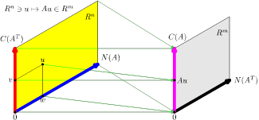

### Matrix and Data

- **Julia & Pluto**: pluto_matrix_and_data.jl  [html](https://fiomfd.github.io/ATCM2025/pluto_matrix_and_data.html)
- **MATLAB livescript**: live_matrix_and_data.mlx
- **Python & Jupyter Notebook**:  python_matrix_and_data.ipynb [Google Colab](https://colab.research.google.com/github/fiomfd/ATCM2025/blob/main/Linear%20Algebra/python_matrix_and_data.ipynb)
- **Metapost**: metapost_linearmap1.mp, visualizing the fundamental theorem of linear algebra
  

These notebooks demonstrate:
- Representation of data using matrices
- Singular value decomposition (SVD) and low-rank approximation
- Haar wavelet transform and multiscale image analysis
